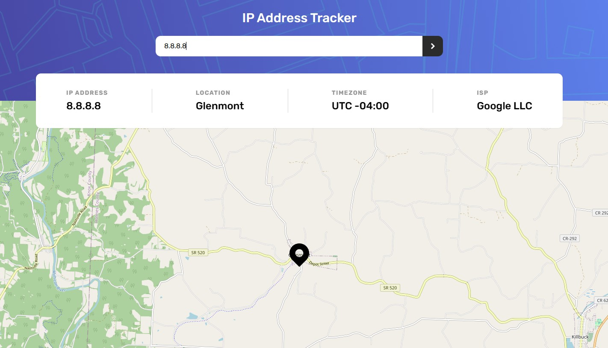

# Frontend Mentor - IP address tracker solution

This is a solution to the [IP address tracker challenge on Frontend Mentor](https://www.frontendmentor.io/challenges/ip-address-tracker-I8-0yYAH0). Frontend Mentor challenges help you improve your coding skills by building realistic projects. 

## Table of contents

- [Overview](#overview)
  - [The challenge](#the-challenge)
  - [Screenshot](#screenshot)
  - [Links](#links)
- [My process](#my-process)
  - [Built with](#built-with)
  - [What I learned](#what-i-learned)
- [Author](#author)

## Overview

### The challenge

Users should be able to:

- View the optimal layout for each page depending on their device's screen size
- See hover states for all interactive elements on the page
- See their own IP address on the map on the initial page load
- Search for any IP addresses or domains and see the key information and location

### Screenshot

### Links

- Solution URL: [https://github.com/Naithcots/ip-tracker](https://github.com/Naithcots/ip-tracker)
- Live Site URL: [https://iptracker.naithcots.ovh](https://iptracker.naithcots.ovh)

## My process

### Built with

- Semantic HTML5 markup
- CSS custom properties
- Flexbox
- CSS Grid
- Mobile-first workflow
- React
- Vite
- Tanstack React Query

### What I learned

An always beneficial grid layout skills and basics of interactive maps with leaflet.

## Author

- Website - [Naithcots](https://naithcots.ovh)
- Frontend Mentor - [@naithcots](https://www.frontendmentor.io/profile/Naithcots)